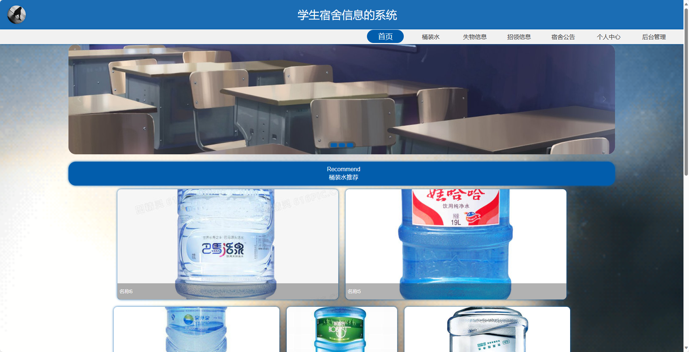
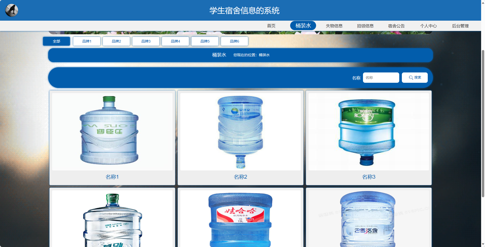
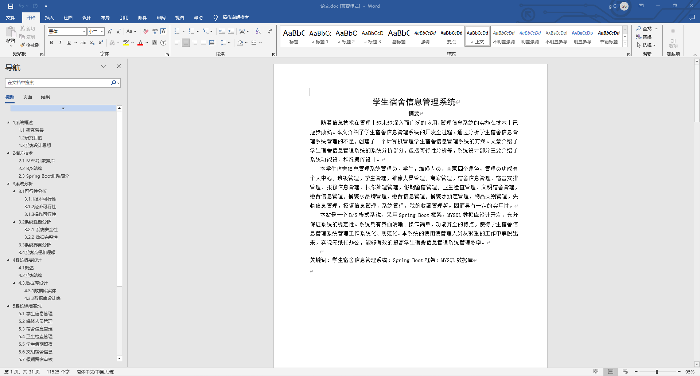
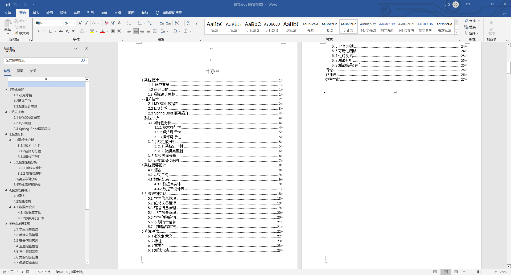
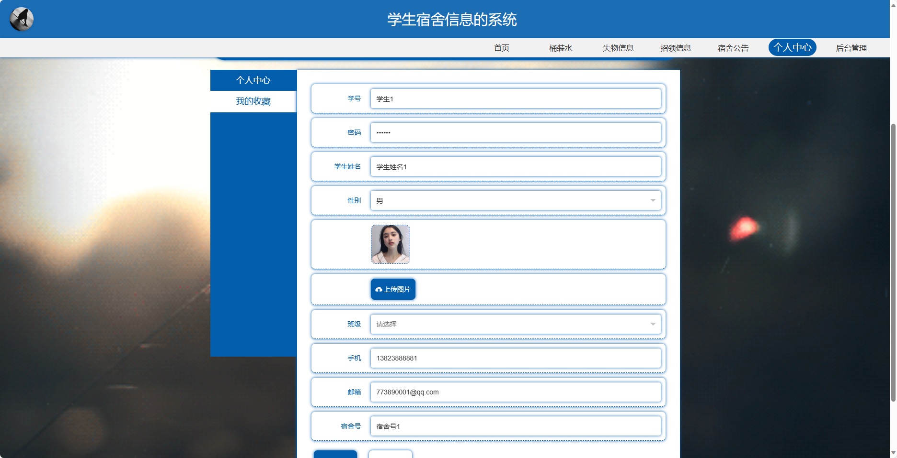
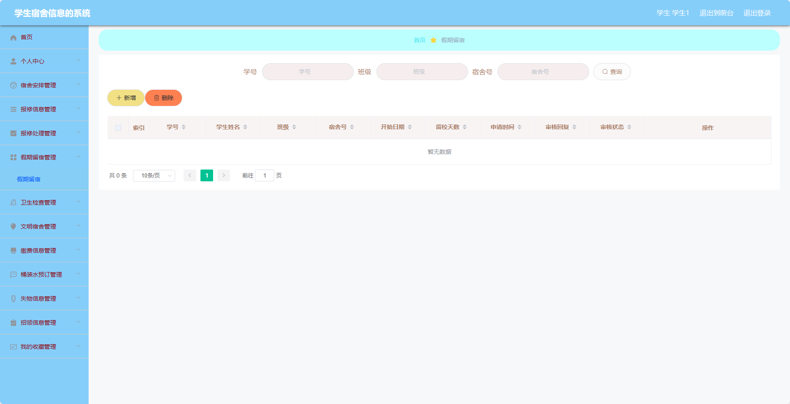

<h1 align="center">基于SpringBoot框架实现的学生宿舍信息系统【带文档】</h1>

 获取sql文件 QQ: 3645296857 QQ群: 978300347 

<h4> 需要视频演示可联系上述QQ，私发视频链接 </h4>

 获取更多高质量源码，请访问：[mzoo源码网](https://mzoocodes.com/)

## 简介

> 本代码来源于网络,仅供学习参考使用!
>
> <b style="color: dodgerblue"> 提供1.远程部署/2.修改代码/3.定制程序/4.文档指导/5.框架代码讲解、技术解答、代码讲解等服务 </b>
>
> 前台地址：http://localhost:8080/springboot68ozj/front/index.html
> 
> 后台地址：http://localhost:8080/springboot68ozj/admin/dist/index.html
>
> 管理员: admin 密码: 123456
> 
> 学生：学生1 密码：123456
> 
> 维修人员：维修人员1 密码：123456
> 
> 商家：商家1 密码：123456
>

## 项目介绍

基于SpringBoot框架实现的学生宿舍信息系统【带文档】：前端 vue、axios、elementui，后端 springboot、mybatis，系统角色分为：管理员、维修人员、商家和学生，管理员在管理后台对用户信息、桶装水信息、报修信息、失物招领管理等；维修人员可以根据工单进行宿舍报修等；商家可以发布桶装水信息等；学生进行宿舍报修、失物招领、桶装水订购等。主要功能如下：

前台功能：
- 首页：展示系统的概览信息和宿舍相关通知。
- 桶装水：用户可以查看桶装水的信息和进行预订。
- 失物信息：用户可以发布和查看失物信息。
- 招领信息：用户可以发布和查看招领信息。
- 宿舍公告：用户可以查看宿舍相关的公告信息。
- 个人中心：用户可以管理个人信息。

## 【后台】
### 管理员

- 个人中心：管理员可以管理个人信息。
- 班级管理：管理员可以管理班级信息。
- 学生管理：管理员可以管理学生信息。
- 维修人员管理：管理员可以管理维修人员信息。
- 商家管理：管理员可以管理商家信息。
- 宿合信息管理：管理员可以查看和管理宿舍相关信息。
- 宿舍安排管理：管理员可以管理宿舍的分配情况。
- 报修信息管理：管理员可以查看和管理报修信息。
- 报修处理管理：管理员可以处理和跟进报修请求。
- 假期留宿管理：管理员可以管理假期留宿的相关信息。
- 卫生检查管理：管理员可以管理卫生检查的相关信息。
- 文明宿舍管理：管理员可以管理文明宿舍合规性。
- 缴费信息管理：管理员可以管理缴费信息。
- 桶装水品牌管理：管理员可以管理桶装水的品牌信息。
- 桶装水管理：管理员可以管理桶装水的具体信息。
- 桶装水预订管理：管理员可以管理桶装水的预订订单。
- 物品类别管理：管理员可以管理物品的分类信息。
- 失物信息管理：管理员可以发布和管理失物信息。
- 招领信息管理：管理员可以发布和管理招领信息。
- 系统管理：管理员可以管理系统的基本设置。

### 学生

- 个人中心：用户可以管理个人信息。
- 宿舍安排管理：用户可以查看和管理宿舍的分配情况。
- 报修信息管理：用户可以提交和查看报修信息。
- 报修处理管理：用户可以查看和处理报修请求。
- 假期留宿管理：用户可以申请和查看假期留宿的相关信息。
- 卫生检查管理：用户可以查看卫生检查相关的信息。
- 文明宿合管理：用户可以查看和管理文明宿舍合规性。
- 缴费信息管理：用户可以查看和管理缴费信息。
- 桶装水预订管理：用户可以预订和管理桶装水的订单。
- 失物信息管理：用户可以发布和管理失物信息。
- 招领信息管理：用户可以发布和管理招领信息。
- 我的收藏管理：用户可以查看和管理自己的收藏信息。

### 维修人员

- 个人中心：维修人员可以管理个人信息。
- 报修信息管理：维修人员可以查看和处理报修信息。
- 报修处理管理：维修人员可以处理和跟进报修请求。

### 商家

- 个人中心：商家可以管理个人信息。
- 桶装水管理：商家可以管理桶装水的信息。
- 桶装水预订管理：商家可以管理桶装水的预订订单。

## 环境

- <b>IntelliJ IDEA 2020.3</b>

- <b>Mysql 5.7.26</b>

- <b>Maven 3.6.3</b>

- <b>JDK 1.8</b>

## 运行截图

